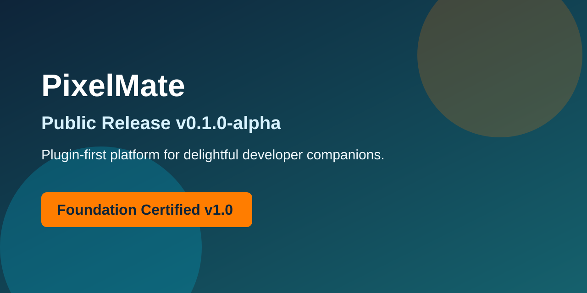

# PixelMate




PixelMate is a plugin-first platform for delightful developer companions.

## Mission

Build a durable, extensible runtime platform where companion capabilities can evolve through explicit contracts, strong quality gates, and stable architecture boundaries.

## Vision

Enable a thriving ecosystem of companion experiences across tools and workflows, with PixelMate serving as the trusted core runtime and extension foundation.

## Architecture

PixelMate uses a monorepo with clear package boundaries and clean dependency direction.

- Runtime host lives in `apps/runtime-vscode`.
- Platform modules live in `packages/*`.
- Governance and design records live in `docs`, `adrs`, and `rfcs`.

Read:
- `ARCHITECTURE.md`
- `ARCHITECTURE_INDEX.md`
- `docs/ARCHITECTURE_DIAGRAM.md`

## Plugin-First Philosophy

- Core runtime remains minimal and stable.
- Extension points are explicit and contract-driven.
- New behavior is expected to arrive through plugins, not core rewrites.
- Architecture decisions are reviewed and documented before implementation.

## Roadmap

- Sprint 1: Foundation baseline (completed)
- Sprint 2: Engine contracts and interface hardening
- Sprint 3: SDK and tooling
- Sprint 4: Ecosystem and marketplace preparation

See `ROADMAP.md` for details.

## Repository Structure

- `apps/`: runtime applications
- `packages/`: reusable platform modules
- `tooling/`: shared scripts and quality configuration
- `docs/`: architecture and product-facing documentation
- `adrs/`: architecture decision entrypoint
- `rfcs/`: request for comments entrypoint
- `meetings/`: meeting history and governance records
- `assets/`: repository visuals and marketplace collateral
- `.github/`: issue forms, workflows, templates, and policy automation

## Development

Prerequisites:
- Node.js 20+
- pnpm 9+

Workspace quality commands:

```bash
pnpm install
pnpm build
pnpm lint
pnpm typecheck
pnpm test
```

Runtime VS Code host:

```bash
pnpm --filter pixelmate-runtime-vscode build
pnpm --filter pixelmate-runtime-vscode package:vsix
```

## Quick Start

1. Read `docs/README.md`.
2. Read `ARCHITECTURE_INDEX.md`.
3. Run quality commands.
4. Launch extension host and execute `PixelMate: Alive Check`.
5. Review `docs/DEVELOPER_JOURNEY.md` before first contribution.

## FAQ

See `docs/FAQ.md`.

## Contributing

Follow `CONTRIBUTING.md` and use GitHub issue forms and PR template.

All non-trivial architecture changes should include RFC and ADR updates.

## License

MIT. See `LICENSE`.

## Foundation Compliance

- Compliance report: `FOUNDATION_COMPLIANCE_REPORT.md`
- Migration plan: `MIGRATION_PLAN.md`
- Security review: `SECURITY_REVIEW.md`
- Foundation certificate: `FOUNDATION_CERTIFICATE.md`
- Foundation manifest: `foundation.yaml`

## Public Release Assets

- Release notes: `RELEASE_NOTES.md`
- Repository profile: `.github/REPOSITORY_PROFILE.md`
- GitHub settings checklist: `.github/REPOSITORY_SETTINGS.md`
