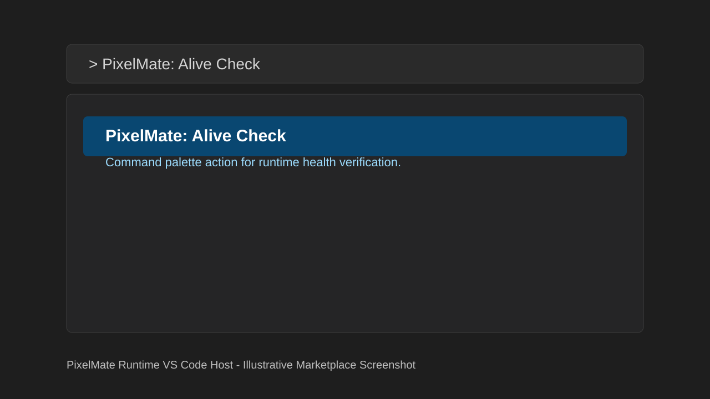
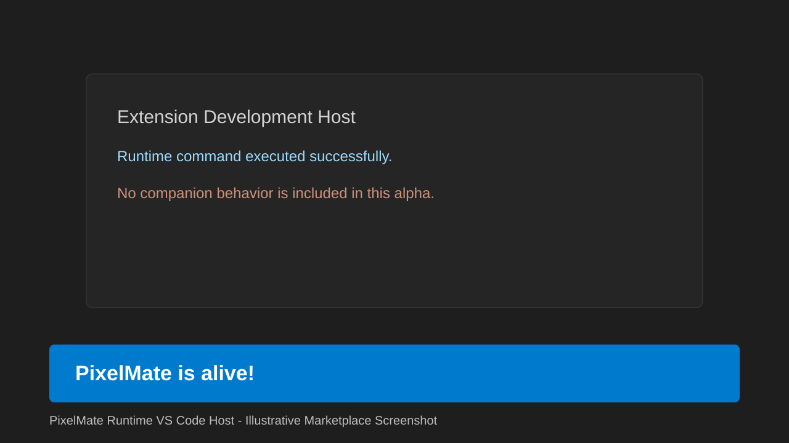

# Runtime VS Code

VS Code Runtime Host for PixelMate.

## Public Alpha Status

This extension is currently in public alpha (`v0.1.0-alpha`).

## Features
- Activates on command pixelmate.alive
- Registers command PixelMate: Alive Check
- Shows message: PixelMate is alive!

## Marketplace Preview Screenshots

## Scripts
- pnpm build
- pnpm test
- pnpm package:vsix

## Repository

- Main repository: https://github.com/aetherexa/pixelmate
- Issues: https://github.com/aetherexa/pixelmate/issues
- Discussions: https://github.com/aetherexa/pixelmate/discussions