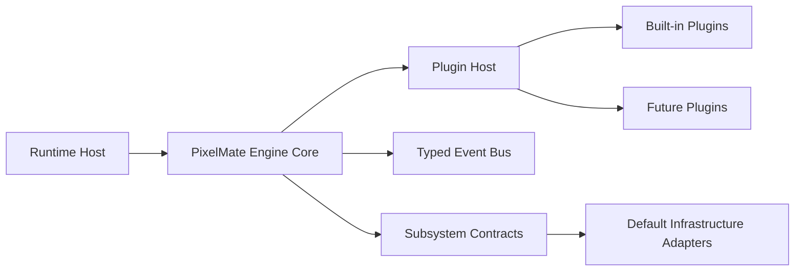
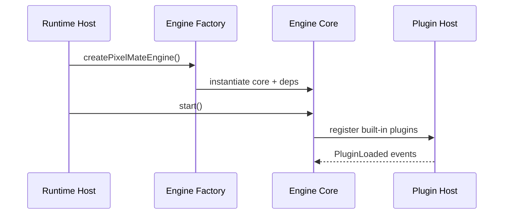

# Architecture Guide

PixelMate Engine follows Clean Architecture and Domain-Driven principles.

## High-Level Design

## Dependency Rule

- Contracts define boundaries.
- Core orchestrates use cases.
- Infrastructure implements contracts.
- Runtime hosts consume only the public engine API.

## Event-Driven Communication

Subsystems and plugins communicate through `EventBus<EngineEventMap>`.

## Replaceability

Each subsystem can be replaced by overriding concrete implementations in composition.

## Startup Sequence

