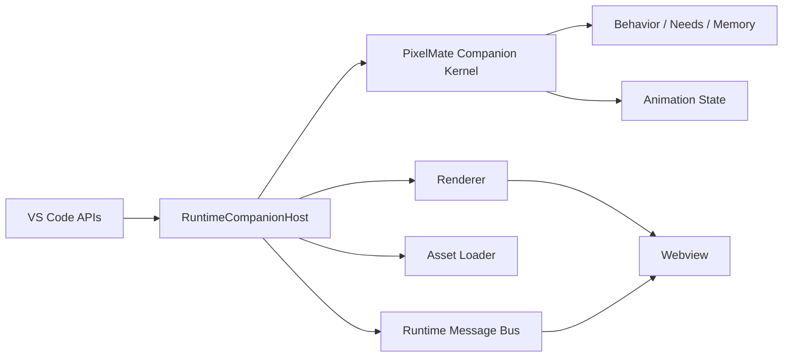

# PixelMate Architecture

PixelMate separates VS Code integration from reusable companion behavior.

```mermaid
flowchart LR
  VS[VS Code APIs] --> RH[RuntimeCompanionHost]
  RH --> K[PixelMate Companion Kernel]
  RH --> MB[Runtime Message Bus]
  K --> B[Behavior / Needs / Memory]
  K --> A[Animation State]
  RH --> AL[Asset Loader]
  RH --> R[Renderer]
  R --> WV[Webview]
  MB --> WV
```

## Runtime host

`apps/runtime-vscode` owns VS Code lifecycle, commands, configuration, editor/task/diagnostic observation, webview lifecycle and message routing.

## Companion kernel

`companions/pixelmate-core` owns lifecycle state, needs, memory, intent, behavior selection, personality and persistence contracts. It must not depend on VS Code APIs.

## Presentation packages

`@aetherexa/animation` advances animation frames. `@aetherexa/asset-loader` owns asset manifests. `@aetherexa/renderer` converts state into presentation descriptors. The webview performs final host-specific rendering.

## Event flow

1. VS Code emits activity.
2. Runtime translates it into a companion event.
3. Kernel updates needs, intent and behavior.
4. Runtime ticks animation/rendering.
5. Snapshot is posted to the webview.
6. The webview presents the selected companion and optional speech/debug UI.

## Design constraints

- preserve clean dependency direction
- keep host-specific code out of core packages
- no runtime network dependency for v1
- hide debug internals in normal mode
- respect reduced motion
- dispose timers/listeners with the extension
- future sprite assets should integrate through existing loader/renderer boundaries rather than a core rewrite
