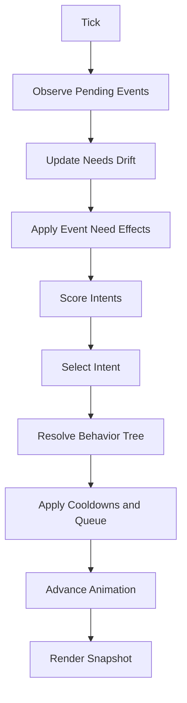
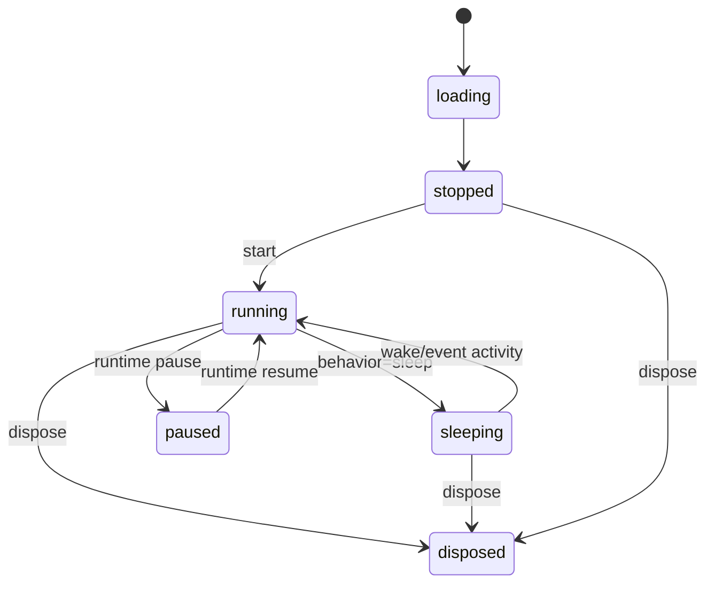

# Living Companion Architecture

## Purpose

This document defines the production runtime architecture for the PixelMate Living Companion Framework.
The framework is deterministic, runtime-independent, renderer-independent, and plugin-extensible.

## Core Design Principles

- Composition over inheritance
- Event-driven subsystem boundaries
- Deterministic decisions (no external AI services)
- Runtime and renderer decoupling
- Replaceable modules via typed interfaces
- Near-zero idle CPU through paced thinking and lightweight animation

## Runtime Pipeline

1. Observe world/runtime events
2. Update needs and memory
3. Evaluate intent with personality weights
4. Resolve behavior through behavior tree rules
5. Schedule animation frames
6. Render snapshot

## Companion Model

A companion instance includes:

- Identity and manifest
- Personality profile
- Needs state
- Memory snapshot
- Intent state
- Behavior queue
- Animation controller
- Renderer adapter
- Runtime settings

## Event Model

The world observer emits domain events into a pub/sub bus.
No subsystem calls another subsystem directly for state mutations.

Events include:

- Editor lifecycle: vscodeStarted, workspaceLoaded, workspaceClosed
- Interaction: typingStarted, typingStopped, activity, cursorIdle
- Build/diagnostics: buildStarted, buildSuccess, buildError, diagnosticError, diagnosticClear
- Focus/window: editorFocus, editorBlur, windowFocus, windowBlur
- Runtime context: themeChanged, openFilesChanged, terminalRunning

## Deterministic Brain Loop

The brain executes on a paced tick and can be interrupted by high-priority events.

## State Machine

## Needs

Needs are normalized to 0-100 and evolve by drift + events.

- curiosity
- energy
- attention
- comfort
- happiness
- rest
- focus

## Personality Profiles

Profiles tune decision and behavior weighting:

- calm
- curious
- playful
- focused
- cheerful

Each profile adjusts:

- reaction speed
- movement frequency
- animation frequency
- intent weights
- behavior biases

## Memory Boundaries

The memory system tracks runtime context only and never stores personal user data.

Tracked fields:

- last build status
- last error timestamp
- last interaction timestamp
- last celebration timestamp
- current workspace label
- open files count
- session length
- last walk timestamp
- last sleep timestamp

## Debug Overlay

Debug mode can display:

- lifecycle state
- intent and behavior
- personality
- summarized needs
- events processed
- fps and frame timing
- idle CPU hint

## Extensibility Points

- behavior plugins can influence event and tick decisions
- renderer can be replaced without changing brain/needs/memory
- runtime observers can be swapped per host platform
- sprite manifests can define alternate assets per behavior

## Validation Targets

- Unit tests for needs, memory, intent, scheduler, behavior decisions
- Kernel integration tests for event-to-behavior flows
- Runtime host tests for activation/lifecycle
- Workspace build validation across all packages
