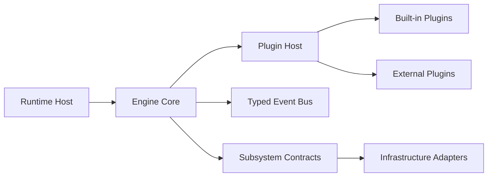

# PixelMate Engineering Blueprint

Version: 1.0
Status: Adopted
Owner: Aetherexa Core Maintainers
Last Updated: 2026-08-06

## Purpose
This document is the authoritative engineering handbook for PixelMate. It defines how PixelMate is designed, built, tested, documented, released, and evolved.

It is intended for:
- Core maintainers
- External contributors
- Runtime host developers
- Plugin and character pack authors
- AI coding agents operating in the repository

This blueprint is normative. If implementation diverges from this document, either:
- Implementation is corrected, or
- This document is updated through the ADR process.

---

## Table of Contents
1. Vision and Mission
2. Product Philosophy
3. Engineering Principles
4. Repository Strategy
5. Engine Architecture
6. Plugin Model
7. Character Specification
8. Performance Budget
9. Security and Privacy
10. Testing Strategy
11. Documentation Standards
12. Coding Standards
13. Versioning Strategy
14. Roadmap
15. Contribution Guide

---

## 1) Vision and Mission

### Why PixelMate Exists
Developers spend long sessions in their editor. Existing companion experiences are often:
- Overly intrusive
- Hardcoded to one character
- Difficult to extend
- Inconsistent across runtimes

PixelMate exists to provide a stable platform where delightful developer companions can be built and evolved without rewriting core systems.

### Problems PixelMate Solves
- Provides a reusable companion engine separated from host runtime details.
- Establishes standardized extension points for animation, dialogue, missions, achievements, themes, and assets.
- Enables an ecosystem where character packs and plugins can evolve independently.
- Ensures quality, performance, and accessibility from first principles.

### Long-Term Vision
PixelMate becomes the most extensible and trusted platform for animated developer companions across editor and tool environments, with:
- A stable engine core
- Multi-runtime hosts
- A robust plugin and character ecosystem
- Strong guarantees for privacy, performance, and accessibility

### Non-Goals
- PixelMate Engine is not itself a VS Code extension.
- PixelMate Engine is not a character implementation.
- PixelMate Engine is not a marketplace product.
- PixelMate Engine is not a monolithic, hardcoded app.

---

## 2) Product Philosophy

### Delight Without Distraction
Companions should enrich focus, not interrupt it.
- Motion and dialogue are contextual, rate-limited, and user-controllable.
- User intent and productivity take precedence over visual novelty.

### Offline-First
All core experiences work offline.
- No network dependency for basic operation.
- Local-first storage and asset resolution.

### Plugin-First
Everything is an extension point.
- Built-in behavior is implemented via plugins.
- New capabilities should require minimal or zero engine modification.

### Performance-First
Companions must feel instant and lightweight.
- Strict activation and render budgets.
- Incremental rendering and lazy loading by default.

### Accessibility-First
Companion experiences must be broadly usable.
- Reduced motion support
- High contrast and theme adaptability
- Keyboard and screen-reader compatible host controls

### Open Ecosystem
The platform should be easy to build on.
- Public contracts
- Stable API governance
- Documentation and examples for contributors

---

## 3) Engineering Principles

### SOLID as Default
- Single Responsibility: modules own one concern.
- Open/Closed: new behavior via extension, not invasive edits.
- Liskov Substitution: contract-based interchangeable implementations.
- Interface Segregation: granular interfaces to reduce coupling.
- Dependency Inversion: core depends on abstractions, not concrete adapters.

### Clean Architecture
Layering rules:
- Contracts define boundaries.
- Core orchestration coordinates use cases.
- Infrastructure implements contracts.
- Runtime hosts adapt environment APIs to engine contracts.

Dependency direction must always point inward to abstractions.

### Domain Boundaries
Domains are isolated by explicit contracts:
- Rendering
- Animation
- Asset management
- State and lifecycle
- Dialogue and missions
- Achievements and statistics
- Storage and settings

Cross-domain calls through concrete types are prohibited.

### Event-Driven Communication
Subsystems communicate by typed events.
- Events are immutable payloads.
- Event names are stable API surface.
- Handlers are isolated and failure-aware.

### Dependency Injection
Composition roots own wiring.
- No hidden service locators in domain logic.
- Testability through injected contracts.

### Testing Philosophy
- Test behavior, not implementation details.
- Require tests for all public behavior changes.
- Keep tests deterministic and fast.

### Documentation Standards
- Public APIs are documented at declaration points.
- Architecture decisions are captured via ADRs.
- Complex flows include diagrams.

### API Stability Policy
- Public APIs are versioned and governed.
- Breaking changes require major version bump, migration notes, and deprecation runway.

---

## 4) Repository Strategy

### Monorepo Layout
Canonical structure:

- packages/pixelmate-engine: reusable engine core and built-in plugins
- packages/runtime-vscode: VS Code runtime host adapter
- packages/sdk: future developer SDK
- packages/cli: future tooling CLI
- packages/character-*: future character packs
- tests: cross-package integration and architecture tests
- docs: architecture, guides, ADRs, references

### Package Responsibilities
- Engine package: host-agnostic platform APIs and default implementations.
- Runtime package: host integration and lifecycle bridging.
- Test package: architecture boundaries and system-level scenarios.

### Naming Conventions
- Scope: @aetherexa
- Packages: kebab-case
- Events: PascalCase
- Interfaces: PascalCase nouns
- Implementations: descriptive suffixes (Default, InMemory, Hook, Adapter)

### Folder Structure Rules
Within each package:
- src/contracts: stable interfaces and event contracts
- src/core: composition and orchestration
- src/infrastructure: replaceable adapters
- src/plugins: built-in plugins
- src/schemas: validation and manifest schemas

### Build System
- pnpm workspaces for dependency graph
- turbo for task orchestration and incremental execution
- TypeScript strict mode across packages

### Release Strategy
- Changesets for version planning
- Conventional commits for change semantics
- CI-gated release flow

---

## 5) Engine Architecture

### System Overview

### Runtime Host
Responsibilities:
- Initialize engine in host lifecycle
- Bridge host storage/events to engine adapters
- Expose host-safe controls

Must not contain character or engine domain logic.

### Core Engine
Responsibilities:
- Startup and shutdown orchestration
- Plugin lifecycle delegation
- Subsystem dependency composition

### Plugin Host
Responsibilities:
- Register/unregister plugins
- Enforce plugin identity uniqueness
- Manage plugin lifecycle hooks
- Emit PluginLoaded and PluginUnloaded events

### Renderer
Responsibilities:
- Scene abstraction
- Layer ordering and z-index handling
- Viewport scaling and high-DPI support
- Dirty-render optimization

### Animation
Responsibilities:
- State-driven animation playback
- Priority and interruption handling
- Timing and completion events

### Asset Pipeline
Responsibilities:
- Manifest registration and validation
- Lazy loading and caching
- Fallback resolution
- Version-aware assets

### Event Bus
Responsibilities:
- Typed event publication and subscription
- Async-safe handler execution
- Clear semantics for ordering and failures

### Storage
Responsibilities:
- Abstract persistence contract
- Implementations: memory, host memento, JSON file
- Migrations and compatibility hooks

### State Machine
Responsibilities:
- Generic FSM transitions
- JSON-defined states and transition maps
- Runtime validation and guarded transitions

### Theme Manager
Responsibilities:
- Theme registration and activation
- Inheritance and override resolution
- Light/dark/auto behavior

### Diagnostics
Responsibilities:
- Structured diagnostics collection
- Severity classification
- Developer tools integration

### Configuration
Responsibilities:
- Runtime config retrieval and updates
- Defaults, profiles, and overrides
- Validation and migration support

---

## 6) Plugin Model

### Plugin Lifecycle
1. Discovery
2. Registration
3. Initialization
4. Active execution
5. Optional disposal
6. Unregistration

### Registration Rules
- Plugin id must be globally unique within process.
- Plugin version must be semver-compliant.
- Required capabilities must be declared.

### Discovery Model
Current baseline:
- Explicit runtime registration

Future:
- Manifest-based discovery
- Marketplace discovery and trust policy

### Extension Points
Examples:
- Animation behaviors
- Theme resolvers
- Dialogue selectors
- Mission generators
- Achievement conditions
- Effects emitters

### Version Compatibility
- Engine API compatibility expressed through semver ranges.
- Plugin declares supported engine range.
- Incompatible plugins fail fast with diagnostic messages.

---

## 7) Character Specification

Character packs are data-first and contract-driven.

### Required Manifests
- Character Manifest
- Theme Manifest
- Dialogue Manifest
- Mission Manifest
- Achievement Manifest
- Animation Manifest
- Accessory Manifest

### Manifest Rules
- Every manifest must include id, name, version.
- Every manifest must pass schema validation before activation.
- Cross-manifest references must resolve.

### Validation Rules
- IDs are unique within namespace.
- Required fields are non-empty.
- Enums and modes are constrained.
- Assets must resolve or have valid fallbacks.
- Invalid packs are rejected with actionable diagnostics.

---

## 8) Performance Budget

### Activation Targets
- Cold start target: under 100ms for core initialization in typical local conditions.
- Plugin initialization should be lazy where possible.

### Memory Targets
- Idle runtime memory overhead should remain low and bounded.
- Avoid unbounded caches.

### Rendering Targets
- Avoid unnecessary redraws.
- Dirty-scene checks before render.
- Frame skipping allowed under pressure.

### Asset Loading Strategy
- Lazy load assets by usage.
- Cache resolved assets.
- Release cache on pressure signals where supported.

Performance regressions are release blockers.

---

## 9) Security and Privacy

### Offline by Default
No network is required for core companion operation.

### No Telemetry by Default
- Telemetry opt-in only.
- Clear user-facing controls and policy.

### Secure Storage
- Sensitive values stored through host-secure facilities when available.
- Avoid storing secrets in plain JSON.

### Marketplace Safety
Future marketplace rules must include:
- Package signing and integrity checks
- Trust metadata and reputation signals
- Automated vulnerability and policy scanning

---

## 10) Testing Strategy

### Unit Tests
- Contract and adapter behavior
- Deterministic branch coverage

### Integration Tests
- Engine startup and plugin lifecycle
- Host-to-engine interactions

### End-to-End Tests
- Runtime host activation and shutdown
- Settings and persistence flow

### Performance Benchmarks
- Startup latency
- Render loop overhead
- Asset load timing

### Visual Regression Tests
- Renderer snapshots for deterministic scenes
- Theme and motion profile snapshots

### Coverage Policy
- Minimum target: 90% for statements, lines, branches, and functions in core packages.
- Coverage exceptions require documented rationale.

---

## 11) Documentation Standards

### Required Documents
- Root README for project orientation
- Package README files
- API references
- Architecture guide
- Plugin and module guides
- ADR records for major decisions

### ADR Policy
Use ADRs for:
- Architectural pivots
- Public API breaking decisions
- Security model changes
- Build/release strategy changes

### Examples and Tutorials
- Minimal runtime host setup
- Minimal plugin example
- Character pack manifest example
- Testing and debugging walkthroughs

---

## 12) Coding Standards

### TypeScript Style
- strict mode enabled
- noImplicitAny equivalent behavior
- noUncheckedIndexedAccess enabled
- exactOptionalPropertyTypes enabled

### File Organization
- Keep modules cohesive and small.
- Avoid deep nesting without clear boundaries.
- Place tests near domain or in dedicated test package according to purpose.

### Error Handling
- Fail fast on invalid inputs and incompatible plugins.
- Provide actionable error messages.
- Avoid silent failures except explicitly documented best-effort paths.

### Logging
- Structured logs with level and context.
- No noisy logs in hot paths.
- Sensitive data must never be logged.

### Naming Conventions
- Interfaces: noun phrases
- Implementations: explicit role-oriented names
- Event names: domain action in past tense where applicable

### Public API Design
- Prefer explicit contracts over magical behavior.
- Keep API surface minimal and composable.
- Document all exported public symbols.

---

## 13) Versioning Strategy

### Semantic Versioning
- MAJOR: breaking API/contract changes
- MINOR: backward-compatible features
- PATCH: backward-compatible fixes

### Plugin Compatibility
- Plugins declare supported engine version ranges.
- Engine enforces compatibility at load time.

### Deprecation Policy
- Deprecate before removal whenever possible.
- Provide migration path and timeline.
- Breaking removals require major release notes.

---

## 14) Roadmap

### Phase 1: Foundation (current)
- Engine core and contracts
- Runtime host for VS Code
- Built-in plugin scaffolding
- Manifest validation

### Phase 2: SDK
- Plugin authoring helpers
- Manifest schema tooling
- Test harness utilities

### Phase 3: CLI
- Pack validation and packaging
- Project scaffolding
- Migration and diagnostics tools

### Phase 4: Marketplace
- Secure discovery and distribution
- Compatibility and trust checks

### Phase 5: Character Packs
- Official reference packs
- Community contribution pathways

### Phase 6: Future Capabilities
- Multi-host runtime adapters
- Advanced animation blending
- Localization frameworks
- Rich ecosystem governance tooling

---

## 15) Contribution Guide

### Branch Strategy
- main: protected, releasable
- feature branches: short-lived and scoped
- release branches: optional for coordinated launches

### Commit Conventions
- Conventional commits required
- Change intent must be machine-readable

### Pull Request Expectations
- Clear problem statement
- Architecture impact notes
- Tests and documentation updates included
- Migration notes for behavior changes

### Review Checklist
- Architecture boundaries preserved
- Public contracts unchanged or intentionally versioned
- Tests added/updated and passing
- Performance and accessibility considerations addressed
- Security and privacy implications reviewed

---

## Governance

### Change Control
Changes to this blueprint require:
1. Pull request with rationale
2. ADR when architectural significance is high
3. Approval by designated maintainers

### Priority Order When Tradeoffs Conflict
1. User trust and privacy
2. Correctness and reliability
3. Accessibility
4. Performance
5. Extensibility
6. Developer ergonomics

### Definition of Done for Platform Changes
A change is complete only when:
- Implementation is merged
- Tests pass and thresholds are satisfied
- Documentation is updated
- Relevant ADR entries are added
- Migration notes are published when needed

This blueprint is the baseline for all future PixelMate engineering decisions.
