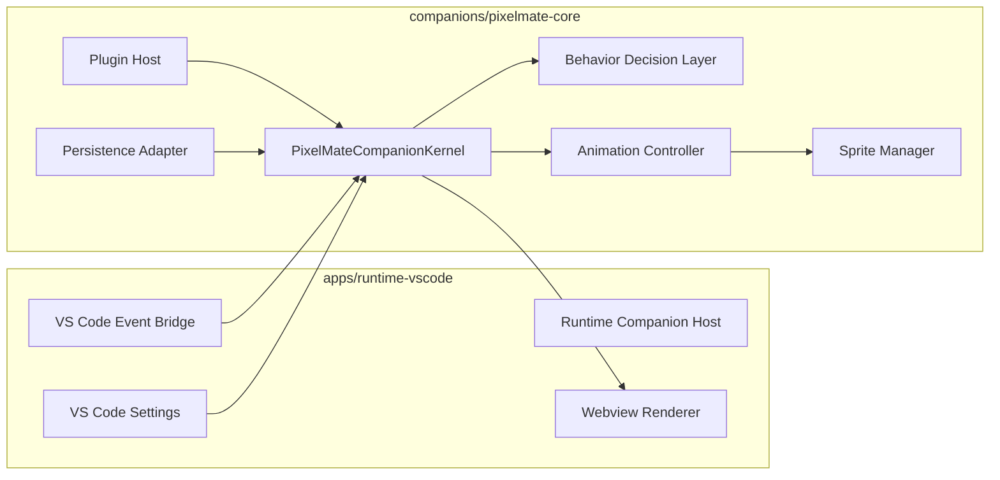

# Reference Companion Architecture Diagram

```mermaid
flowchart LR
  subgraph RuntimeAdapter[apps/runtime-vscode]
    VH[Runtime Companion Host]
    EV[VS Code Event Bridge]
    WV[Webview Renderer]
    CFG[VS Code Settings]
  end

  subgraph Core[companions/pixelmate-core]
    K[PixelMateCompanionKernel]
    BT[Behavior Decision Layer]
    AN[Animation Controller]
    SM[Sprite Manager]
    PH[Plugin Host]
    PS[Persistence Adapter]
  end

  EV --> K
  CFG --> K
  K --> BT
  K --> AN
  AN --> SM
  PH --> K
  PS --> K
  K --> WV
```
