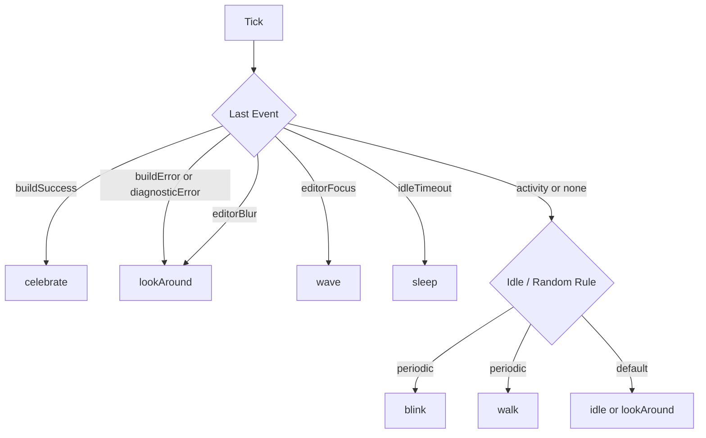

# Companion Behavior Diagram

```mermaid
flowchart TD
  Tick[Tick] --> E{Last Event}
  E -->|buildSuccess| Celebrate[celebrate]
  E -->|buildError or diagnosticError| LookAround[lookAround]
  E -->|editorFocus| Wave[wave]
  E -->|editorBlur| LookAround
  E -->|idleTimeout| Sleep[sleep]
  E -->|activity or none| IdleRule{Idle / Random Rule}

  IdleRule -->|periodic| Blink[blink]
  IdleRule -->|periodic| Walk[walk]
  IdleRule -->|default| Idle[idle or lookAround]
```
