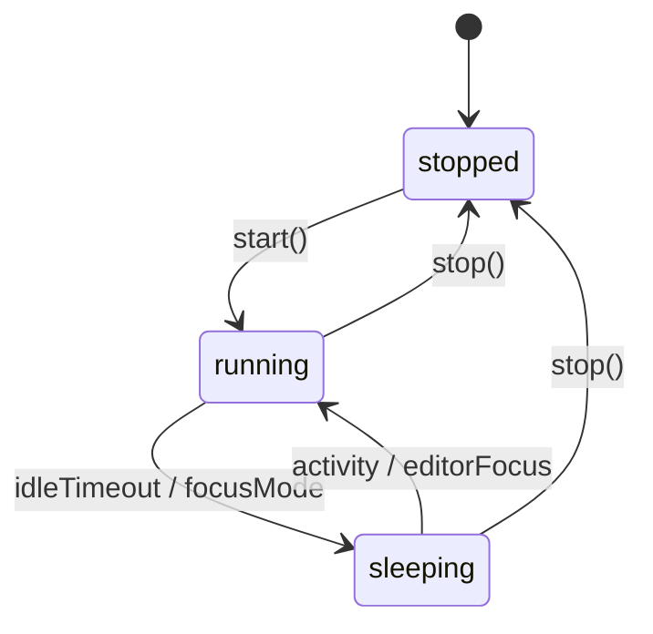

# Companion Lifecycle Diagram

```mermaid
stateDiagram-v2
  [*] --> stopped
  stopped --> running: start()
  running --> sleeping: idleTimeout / focusMode
  sleeping --> running: activity / editorFocus
  running --> stopped: stop()
  sleeping --> stopped: stop()
```
